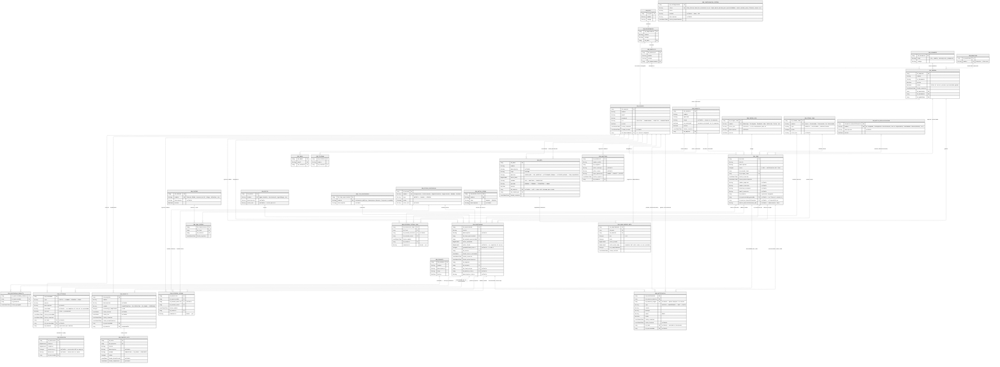

```mermaid
---
config:
  layout: elk
  fontFamily: '''Source Code Pro Variable'', monospace'
  look: classic
  themeVariables:
    fontFamily: '''Source Code Pro Variable'', monospace'
  theme: neutral
---
erDiagram
	direction TB
	CRM_PAIS {
		Long id_pais PK ""  
		String nombre  ""  
		String codigo  ""  
	}

	CRM_DEPARTAMENTO {
		Long id_departamento PK ""  
		String nombre  ""  
		String codigo  ""  
		Long id_pais FK ""  
	}

	CRM_MUNICIPIO {
		Long id_municipio PK ""  
		String nombre  ""  
		String codigo  ""  
		Long id_departamento FK ""  
	}

	CRM_DOCUMENTO {
		Long id_documento PK ""  
		String tipo  "nit, cedula, extranjeria, pasaporte"  
		String codigo  ""  
	}

	CRM_SECTOR {
		Long id_sector PK ""  
		String nombre UK "Agua Potable, Gas Natural, Agro/Riego, etc."  
		String descripcion  "nullable"  
		String color_hex  "nullable — color para UI"  
	}

	CRM_MODALIDAD {
		Long id_modalidad PK ""  
		String nombre UK "Interior | Exterior"  
	}

	CRM_CONFIGURACION_SISTEMA {
		Long id_configuracion PK ""  
		String clave UK "dias_alerta_lead_sin_contactar(o por tipo),monto_minimo_para_oportunidades, monto_minimo_para_clientes_nuevos etc."  
		String valor  ""  
		String unidad  "nullable — días, COP"  
		String descripcion  "nullable"  
		LocalDateTime fecha_actualizacion  ""  
	}

	CRM_USUARIO {
		Long id_usuario PK ""  
		String nombre  ""  
		String email  ""  
		String password  ""  
		String rol  "EJECUTIVO | COORDINADOR | DIRECTOR | ADMINISTRADOR"  
		Boolean activo  ""  
		LocalDateTime fecha_creacion  ""  
		LocalDateTime ultimo_acceso  "nullable"  
		Long id_departamento FK "territorio asignado"  
	}

	CRM_EMPRESA {
		Long id_empresa PK ""  
		String nombre  ""  
		String no_documento  ""  
		Boolean activo  ""  
		Boolean nuevo  "false al cerrar primera oportunidad ganada"  
		LocalDateTime fecha_creacion  ""  
		Long id_municipio FK ""  
		Long id_documento FK ""  
		Long id_modalidad FK ""  
	}

	CRM_CONTACTO {
		Long id_contacto PK ""  
		String nombre  ""  
		String apellido  ""  
		String cargo  "nullable — cargo en la empresa"  
		Boolean es_principal  "contacto principal de la empresa"  
		Boolean activo  ""  
		LocalDateTime fecha_creacion  ""  
		Long id_empresa FK ""  
	}

	CRM_EMAIL {
		Long id_email PK ""  
		String email UK ""  
		Long id_contacto FK ""  
	}

	CRM_TELEFONO {
		Long id_telefono PK ""  
		String numero  ""  
		Long id_contacto FK ""  
	}

	CRM_ORIGEN_LEAD {
		Long id_origen_lead PK ""  
		String nombre UK "WhatsApp, Instagram, Facebook, Web, Referido, Feria, etc."  
		String color_hex  "nullable — color distintivo para UI"  
		String descripcion  "nullable"  
		Boolean activo  ""  
	}

	CRM_ESTADO_LEAD {
		Long id_estado_lead PK ""  
		String nombre UK "Nuevo, Contactado, Interesado, No Interesado"  
		String tipo  "ABIERTO | CALIFICADO | DESCALIFICADO"  
		Integer orden  ""  
		String color_hex  "nullable"  
	}

	CRM_INTERES {
		Long id_interes PK ""  
		String nombre UK "Tubería PE100, Accesorios PE, Riego, Válvulas, etc."  
		String descripcion  "nullable"  
		Boolean activo  ""  
	}

	CRM_MOTIVO_DESCALIFICACION {
		Long id_motivo_descalificacion PK ""  
		String nombre UK "No responde, Presupuesto insuficiente, No es responsable,Trasladado a distribuidor, etc."  
		String descripcion  "nullable"  
		Boolean activo  ""  
	}

	CRM_LEAD_INTERES {
		Long id_lead_interes PK ""  
		Long id_lead FK ""  
		Long id_interes FK ""  
		LocalDateTime fecha_registro  ""  
	}

	CRM_HISTORIAL_ESTADO_LEAD {
		Long id_historial_lead PK ""  
		Long id_lead FK ""  
		Long id_estado_anterior FK "nullable"  
		Long id_estado_nuevo FK ""  
		LocalDateTime fecha_cambio  ""  
		Long id_usuario FK ""  
		String comentario  "Desde <ESTADO ANTERIOR> · por <USUARIO>"  
	}

	CRM_PRODUCTO {
		Long id_producto PK ""  
		String nombre  ""  
		String descripcion  ""  
		String tipo  ""  
		Boolean activo  ""  
	}

	CRM_TIPO_OPORTUNIDAD {
		Long id_tipo_oportunidad PK ""  
		String nombre UK "Licitación pública, Suministro directo, Proyecto a medida"  
		String descripcion  "nullable"  
	}

	CRM_ESTADO_OPORTUNIDAD {
		Long id_estado PK ""  
		String nombre UK "Prospección, Calificación, Especificación, Negociación, Ganada, Perdida"  
		String tipo  "ABIERTO | GANADO | PERDIDO"  
		Integer orden  ""  
		String color_hex  "nullable"  
	}

	CRM_MOTIVO_CIERRE {
		Long id_motivo_cierre PK ""  
		String nombre UK ""  
		String tipo  "GANADO | PERDIDO"  
		String descripcion  "nullable"  
	}

	CRM_OPORTUNIDAD {
		Long id_oportunidad PK ""  
		String titulo  ""  
		String descripcion  "nullable"  
		Long id_tipo_oportunidad FK ""  
		Long id_estado_oportunidad FK ""  
		BigDecimal valor_estimado  ""  
		BigDecimal valor_final  "nullable — se completa al cerrar"  
		Integer probabilidad_cierre  "nullable — 0-100 %"  
		Long id_sector FK ""  
		LocalDate fecha_cierre_estimada  ""  
		LocalDateTime fecha_creacion  ""  
		LocalDateTime fecha_actualizacion  ""  
		Long id_empresa FK ""  
		Long id_usuario FK ""  
		Long id_lead_origen FK "nullable"  
		Long id_motivo_cierre FK "nullable"  
		String descripcion_cierre  "nullable"  
	}

	CRM_OPORTUNIDAD_PRODUCTO {
		Long id_oportunidad_producto PK ""  
		Long id_oportunidad FK ""  
		Long id_producto FK ""  
		LocalDateTime fecha_agregado  ""  
	}

	CRM_ACTIVIDAD {
		Long id_actividad PK ""  
		String tipo  "VISITA | LLAMADA | REUNION | EMAIL"  
		String asunto  ""  
		String descripcion  "nullable"  
		String resultado  "nullable — se completa el día de la actividad"  
		Boolean virtual  "false = presencial"  
		LocalDateTime fecha_actividad  ""  
		LocalDateTime fecha_creacion  ""  
		Long id_lead FK "nullable"  
		Long id_oportunidad FK "nullable"  
		Long id_usuario FK "ejecutivo que realiza"  
	}

	CRM_UBICACION {
		Long id_ubicacion PK ""  
		BigDecimal latitud  ""  
		BigDecimal longitud  ""  
		Integer precision_m  "nullable — precisión GPS en metros"  
		String direccion  "nullable — dirección en texto"  
		Long id_actividad FK ""  
	}

	CRM_PROYECTO {
		Long id_proyecto PK ""  
		String nombre  ""  
		String descripcion  "nullable"  
		String estado  "PLANIFICACION | EN_EJECUCION | EN_PAUSA | ENTREGADO"  
		Integer porcentaje_completado  "0–100"  
		LocalDate fecha_inicio  "nullable"  
		LocalDate fecha_fin  "nullable"  
		LocalDateTime fecha_creacion  ""  
		LocalDateTime fecha_actualizacion  ""  
		Long id_oportunidad FK ""  
		Long id_usuario FK "responsable"  
	}

	CRM_PROYECTO_HITO {
		Long id_hito PK ""  
		Long id_proyecto FK ""  
		String titulo  ""  
		String descripcion  "nullable"  
		String estado  "COMPLETADO | EN_CURSO | PENDIENTE"  
		Integer orden  ""  
		LocalDate fecha_planificada  "nullable"  
		LocalDate fecha_completado  "nullable"  
	}

	CRM_HISTORIAL_ESTADO {
		Long id_historial PK ""  
		Long id_oportunidad FK ""  
		Long id_estado_anterior FK "nullable"  
		Long id_estado_nuevo FK ""  
		LocalDateTime fecha_cambio  ""  
		Long id_usuario FK ""  
		String comentario  "Desde <ESTADO ANTERIOR> · por <USUARIO>"  
	}

	CRM_META {
		Long id_meta PK ""  
		String nombre  ""  
		String descripcion  "nullable"  
		String tipo  "SISTEMA"  
		String metrica  "VENTAS_MES | OPP_ABIERTAS | ACTIVIDADES_SEMANA | CLIENTES_NUEVOS | TASA_CONVERSION"  
		BigDecimal valor_meta  ""  
		String unidad  "COP | CANTIDAD | PORCENTAJE"  
		String periodo  "MENSUAL | SEMANAL | TRIMESTRAL | ANUAL"  
		Boolean activo  ""  
		Long id_usuario FK "nullable — null = meta del sistema para todos"  
		Long id_creado_por FK ""  
		LocalDateTime fecha_creacion  ""  
	}

	CRM_CUMPLIMIENTO_META {
		Long id_cumplimiento PK ""  
		Long id_meta FK ""  
		Long id_usuario FK ""  
		Integer mes  "1–12"  
		Integer anio  ""  
		BigDecimal valor_actual  ""  
		BigDecimal valor_meta_snap  "snapshot del valor meta en ese periodo"  
		Integer pct_cumplimiento  ""  
		LocalDateTime fecha_calculo  ""  
	}

	CRM_NOTIFICACION {
		Long id_notificacion PK ""  
		Long id_usuario_destino FK ""  
		Long id_usuario_origen FK "nullable — quien disparó la alerta"  
		String tipo  "CRITICA | ADVERTENCIA | INFO | EXITO"  
		String titulo  ""  
		String mensaje  ""  
		String canal  "EMAIL"  
		Boolean leida  ""  
		LocalDateTime fecha_creacion  ""  
		LocalDateTime fecha_lectura  "nullable"  
		Long id_lead FK "nullable — entidad relacionada"  
		Long id_oportunidad FK "nullable"  
	}

	CRM_AUDITORIA {
		Long id_auditoria PK ""  
		String nombre_tabla  ""  
		Long id_registro  ""  
		String valor_antiguo  "nullable"  
		String valor_nuevo  "nullable"  
		String tipo_operacion  "INSERT | UPDATE | DELETE"  
		LocalDateTime fecha_registro  ""  
		Long id_usuario FK ""  
	}

	CRM_LEAD {
		Long id_lead PK ""  
		String titulo  ""  
		String descripcion  ""  
		Integer score  "0–100 — calificación del lead"  
		Long id_estado_lead FK ""  
		Long id_origen_lead FK ""  
		LocalDateTime fecha_creacion  ""  
		LocalDateTime fecha_actualizacion  ""  
		String nombre_empresa  "nullable"  
		String nombre_contacto  "nullable"  
        String telefono_contacto  "nullable" 
        String email_contacto  "nullable" 
		Long id_usuario FK "ejecutivo asignado"  
		Long id_oportunidad_generada FK "nullable — se llena al convertir"  
		Long id_motivo_descalificacion FK "nullable — al descalificar"  
		String motivo_descalificacion_obs  "nullable — observación libre"  
	}

	CRM_PAIS||--o{CRM_DEPARTAMENTO:"contiene"
	CRM_DEPARTAMENTO||--o{CRM_MUNICIPIO:"contiene"
	CRM_DEPARTAMENTO||--o{CRM_USUARIO:"territorio asignado"
	CRM_MUNICIPIO||--o{CRM_EMPRESA:"ubicada en"
	CRM_DOCUMENTO||--o{CRM_EMPRESA:"tipo documento"
	CRM_MODALIDAD||--o{CRM_EMPRESA:"modalidad comercial"
	CRM_EMPRESA||--o{CRM_CONTACTO:"tiene contactos"
	CRM_CONTACTO||--o{CRM_EMAIL:"tiene emails"
	CRM_CONTACTO||--o{CRM_TELEFONO:"tiene teléfonos"
	CRM_ORIGEN_LEAD||--o{CRM_LEAD:"origen"
	CRM_ESTADO_LEAD||--o{CRM_LEAD:"estado actual"
	CRM_EMPRESA||--o{CRM_LEAD:"empresa relacionada"
	CRM_CONTACTO||--o{CRM_LEAD:"contacto asociado"
	CRM_USUARIO||--o{CRM_LEAD:"asignado a"
	CRM_MOTIVO_DESCALIFICACION|o--o{CRM_LEAD:"motivo descalificación"
	CRM_LEAD||--o{CRM_LEAD_INTERES:"tiene intereses"
	CRM_INTERES||--o{CRM_LEAD_INTERES:"aplica a lead"
	CRM_LEAD||--o{CRM_HISTORIAL_ESTADO_LEAD:"cambia estado"
	CRM_ESTADO_LEAD||--o{CRM_HISTORIAL_ESTADO_LEAD:"estado anterior"
	CRM_ESTADO_LEAD||--o{CRM_HISTORIAL_ESTADO_LEAD:"estado nuevo"
	CRM_USUARIO||--o{CRM_HISTORIAL_ESTADO_LEAD:"ejecuta cambio"
	CRM_LEAD||--o|CRM_OPORTUNIDAD:"se convierte en"
	CRM_LEAD||--o{CRM_OPORTUNIDAD:"lead de origen"
	CRM_EMPRESA||--o{CRM_OPORTUNIDAD:"genera"
	CRM_TIPO_OPORTUNIDAD||--o{CRM_OPORTUNIDAD:"clasifica"
	CRM_ESTADO_OPORTUNIDAD||--o{CRM_OPORTUNIDAD:"estado actual"
	CRM_SECTOR||--o{CRM_OPORTUNIDAD:"sector"
	CRM_USUARIO||--o{CRM_OPORTUNIDAD:"asignada a"
	CRM_MOTIVO_CIERRE|o--o{CRM_OPORTUNIDAD:"motivo de cierre"
	CRM_OPORTUNIDAD||--o{CRM_OPORTUNIDAD_PRODUCTO:"incluye productos"
	CRM_PRODUCTO||--o{CRM_OPORTUNIDAD_PRODUCTO:"asociado a"
	CRM_LEAD||--o{CRM_ACTIVIDAD:"actividades del lead"
	CRM_OPORTUNIDAD||--o{CRM_ACTIVIDAD:"actividades de la oportunidad"
	CRM_USUARIO||--o{CRM_ACTIVIDAD:"realiza"
	CRM_ACTIVIDAD||--o|CRM_UBICACION:"ubicada en (GPS)"
	CRM_OPORTUNIDAD||--o|CRM_PROYECTO:"genera proyecto"
	CRM_USUARIO||--o{CRM_PROYECTO:"responsable"
	CRM_PROYECTO||--o{CRM_PROYECTO_HITO:"tiene hitos"
	CRM_OPORTUNIDAD||--o{CRM_HISTORIAL_ESTADO:"cambia estado"
	CRM_ESTADO_OPORTUNIDAD||--o{CRM_HISTORIAL_ESTADO:"estado anterior"
	CRM_ESTADO_OPORTUNIDAD||--o{CRM_HISTORIAL_ESTADO:"estado nuevo"
	CRM_USUARIO||--o{CRM_HISTORIAL_ESTADO:"ejecuta cambio"
	CRM_USUARIO||--o{CRM_META:"metas personales"
	CRM_USUARIO||--o{CRM_META:"crea metas"
	CRM_META||--o{CRM_CUMPLIMIENTO_META:"seguimiento mensual"
	CRM_USUARIO||--o{CRM_CUMPLIMIENTO_META:"registra cumplimiento"
	CRM_USUARIO||--o{CRM_NOTIFICACION:"recibe notificaciones"
	CRM_USUARIO||--o{CRM_NOTIFICACION:"genera notificación"
	CRM_LEAD||--o{CRM_NOTIFICACION:"notificación sobre lead"
	CRM_OPORTUNIDAD||--o{CRM_NOTIFICACION:"notificación sobre opp"
	CRM_USUARIO||--o{CRM_AUDITORIA:"registra cambios"
```